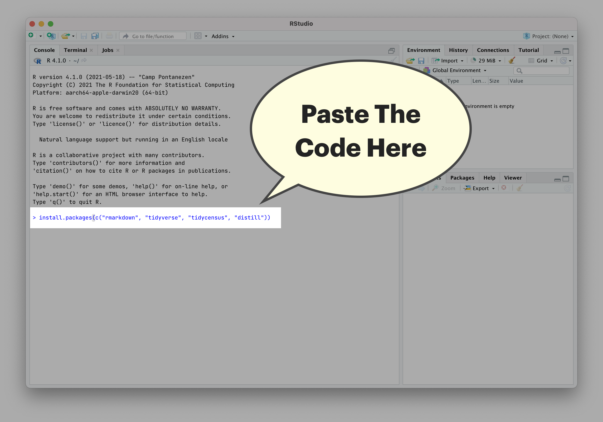

class: middle

```{r setup, include=FALSE}
options(htmltools.dir.version = FALSE)
knitr::opts_chunk$set(message = FALSE, warning = FALSE, comment = "", cache = FALSE, fig.retina = 3)
library(flipbookr)        # Makes Step-by-Step Code Demos
library(xaringanExtra)    # Package with Useful Stuff For Making Slides
library(tidyverse)        # What loads the core set of Modern R Packages, like ggplot2
library(tidycensus)       # Tidyverse-friendly connection to Census API
library(janitor)          # Really useful functions for cleaning data
library(lubridate)        # Makes Working With Dates Pretty Easy
library(grid)             # Organizes Visual Objects
library(ggtext)           # Helps with text in ggplot2 objects
library(cowplot)          # Helps with arranging and layering of ggplot2 objects 
library(hrbrthemes)       # A ppackage I really like with lots of useful functions
library(htmlwidgets)
library(lbjdata)
library(gt)
library(flair)
readRenviron("~/.Renviron")
census_api_key <- Sys.getenv("CENSUS_API_KEY")
```

```{r xaringanExtra, include=FALSE}
xaringanExtra::use_xaringan_extra(c("tile_view", "panelset", "animate_css", "tachyons"))

xaringanExtra::use_share_again()
xaringanExtra::style_share_again(
  share_buttons = c("twitter", "linkedin")
)

xaringanExtra::use_extra_styles(
  hover_code_line = TRUE,         #<<
  mute_unhighlighted_code = TRUE  #<<
)

xaringanExtra::use_logo(
  image_url = "https://raw.githubusercontent.com/utexas-lbjp-data/slides/main/modern_workflows/assets/lbj_white.svg?token=AB6K4YWD4CGWBUZPFKNLNRTAE4LDW"
)

xaringanExtra::use_fit_screen()

htmltools::tagList(
  xaringanExtra::use_clipboard(
    button_text = "<i class=\"fa fa-clipboard\"></i>",
    success_text = "<i class=\"fa fa-check\" style=\"color: #90BE6D\"></i>",
    error_text = "<i class=\"fa fa-times-circle\" style=\"color: #F94144\"></i>"
  ),
  rmarkdown::html_dependency_font_awesome()
)
```

# Prework

This is a resource to get prepared for Dr. Abner's Public Management class using R and Rstudio. In order for the workshop to go smoothly and, more importantly, for you to get something out of it, you'll need to do a few things to get setup. If you have any questions during prework, please contact one of us at the following emails before class:

* Matt Worthington: [matthew.worthington@austin.utexas.edu](matthew.worthington@austin.utexas.edu)

#### Class Workshop Dates:

* Public Management: Sep 1, 2021
* Public Management: Sep 13, 2021


---
class: middle

.pull-left[
## About The Workshop

Whether you're conducting a comprehensive program evaluation, making some clean charts and maps, or working to build a sophisticated statistical model, the tools inside [RStudio](https://www.rstudio.com/products/rstudio/download/#download) and the [tidyverse](https://www.tidyverse.org) make policy work incredibly efficient *and* reproducible. While this workshop is designed to help you get started in R as a policy student, *getting good at R takes practice*. The good news, we're giving you a framework that will make your learning easier and more beneficial over time (both at LBJ and after graduation).


]

.pull-right.b--gray.ba.bw2.ma2.pa4.shadow-1[

**In the session, we cover the following:**

*	Navigating Rstudio
  *	Rstudio Interface
  *	R Projects
  * R Markdown
      - Markdown Text
      - Code Chunks
* Creating Nice Reports
  * PDF
  * Word
  * HTML
*	Getting Data You Need
  * Things People Give You
  * Things That Live Online
*	Making Good Charts
* Exporting Data & Charts


]

.tr.burntorange[
**Next: Prework** `-->`
]

---
class: middle

### Taks 1: Setup RStudio

The next method to get started with RStudio is by setting up RStudio locally on your desktop. If you have any troubles getting setup, shoot me an email at [matthew.worthington@austin.utexas.edu](matthew.worthington@austin.utexas.edu)

.pull-left.b--gray.ba.bw2.ma2.pa4.shadow-1[

**INSTRUCTIONS**

**Step 1:** Go to [this link](https://rstudio.com/products/rstudio/download/#download).  

**Step 2:** Follow the two-step instructions on that page. 

**Step 3:** For visual assistance, use the video tutorial on the right. 

**Step 4:** Congrats, you're ready! 


]

.pull-right[ 

 **Video Tutorial**

<iframe width="550" height = "316" src="https://www.youtube-nocookie.com/embed/k7DuOUEO7SE" frameborder="0" style = "border: solid 0px #ffffff" color = "white"  modestbranding = "1" allow="accelerometer; autoplay; clipboard-write; encrypted-media; gyroscope; picture-in-picture" allowfullscreen data-external="1"></iframe>

]

---
class: middle

.pull-left[

### Task 2: Learning Markdown 

If you're not familiar with Markdown, that's okay. If you're like me, you grew up using things like Microsoft Office and Google Docs to write, so you're probably not familiar with markdown, but Markdown is a lot easier. So... what is it? 

Markdown is just an easy way to write formatted text.  Like anything else, it takes practice, but is used widely in popular writing apps like [Bear](https://bear.app), [iA Writer](https://ia.net/writer), [Ulysses](https://ulysses.app). For the purposes of this workshop, we'll use it in an RStudio document tool called "[Rmarkdown](https://rmarkdown.rstudio.com)". Here's a quick way to get familiar with writing in Markdown:

.bg--burntorange.b--text-color.ba.bw2.br3.shadow-5.ph4.mt5.f7[
*__Note__: If writing in Markdown still feels weird, don't worry. I'll also show you some tricks inside RStudio to make writing easier. Just make sure to do this tutorial.*
]

]

.pull-right[


* **First, visit this link:** Go to [https://commonmark.org/help/tutorial/](https://commonmark.org/help/tutorial/)  
* **Then, do the 10-minute tutorial:** It's a bit of time, but goes quick and will help you have a better grasp on writing in markdown by the time we start the workshop.
* **Finally, bookmark this site**: [https://commonmark.org/help/](https://commonmark.org/help/)

]

---

class: middle

.pull-left[


### Task 3: Install Workshop Packages

We'll need a few packages during the workshop, so try installing these. If you have trouble, shoot me an email at [matthew.worthington@austin.utexas.edu](matthew.worthington@austin.utexas.edu):

* **Step one:** Open RStudio after you've installed it.
* **Step two:** Paste the code below in your console (see screenshot)

```r
install.packages(c("rmarkdown", "tidyverse", "tidycensus", "distill"))
```

]

.pull-right[


</br></br>
</br></br>



]