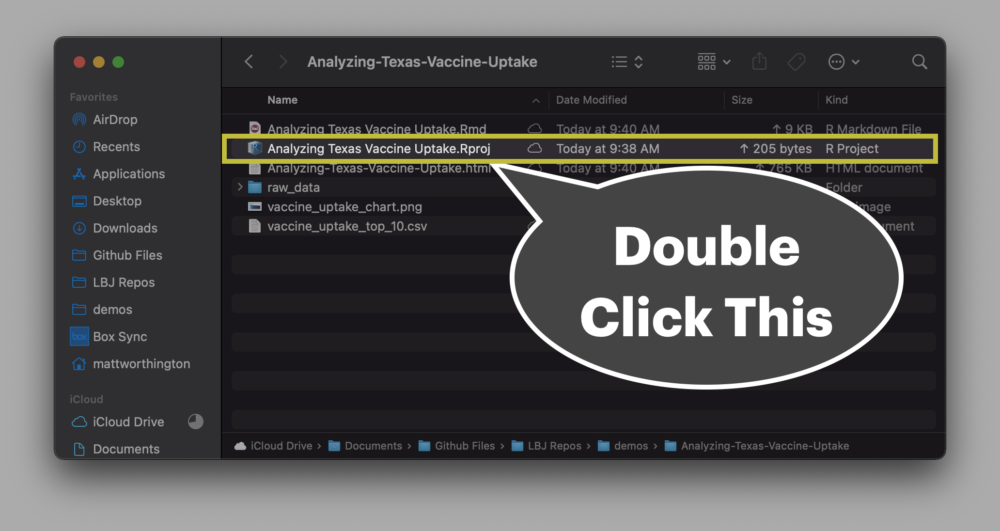
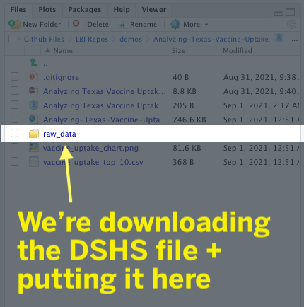

```{r setup, include=FALSE}
options(htmltools.dir.version = FALSE)
knitr::opts_chunk$set(message = FALSE, warning = FALSE, comment = "", cache = FALSE, fig.retina = 3)
library(flipbookr)        # Makes Step-by-Step Code Demos
library(xaringanExtra)    # Package with Useful Stuff For Making Slides
library(tidyverse)        # What loads the core set of Modern R Packages, like ggplot2
library(tidycensus)       # Tidyverse-friendly connection to Census API
library(janitor)          # Really useful functions for cleaning data
library(lubridate)        # Makes Working With Dates Pretty Easy
library(grid)             # Organizes Visual Objects
library(ggtext)           # Helps with text in ggplot2 objects
# library(cowplot)          # Helps with arranging and layering of ggplot2 objects 
# library(hrbrthemes)       # A package I really like with lots of useful functions
library(gt)               # A package for making really nice tables in R
library(gtExtras)
library(flair)
library(htmlwidgets)
readRenviron("~/.Renviron")
census_api_key <- Sys.getenv("CENSUS_API_KEY")
```

```{r metathis, echo=FALSE}
library(metathis)
meta() %>%
  meta_name("github-repo" = "utexas-lbjp-data/Analyzing-Texas-Vaccine-Uptake") %>% 
  meta_social(
    title = "Introduction to R + the tidyverse",
    description = paste(
      "Becoming familiar with R, R Markdown, and the tidyverse for Policy Work.",
      "Presented ain Dr. Abner's LBJ School Class in Fall 2021."
    ),
    url = "https://slides.lbjdata.org/course_workshops/abner/intro_r_workshop/intro_slides",
    image = "https://slides.lbjdata.org/course_workshops/abner/intro_r_workshop/assets/images/hp_vs_r.png",
    image_alt = paste(
      "Title slide of An Introduction R + the tidyverse"
      ),
    og_type = "website",
    og_author = "Matt Worthington",
    twitter_card_type = "summary_large_image",
    twitter_creator = "@mrworthington",
    twitter_site = "@mrworthington"
  )
```

```{r xaringanExtra, echo=FALSE}
xaringanExtra::use_xaringan_extra(c("tile_view", "animate_css", "tachyons"))

xaringanExtra::use_share_again()
xaringanExtra::use_webcam()
xaringanExtra::style_share_again(
  share_buttons = c("twitter", "linkedin", "pocket")
)

xaringanExtra::use_extra_styles(
  hover_code_line = TRUE,         #<<
  mute_unhighlighted_code = TRUE  #<<
)

# xaringanExtra::use_broadcast()

xaringanExtra::use_fit_screen()

htmltools::tagList(
  xaringanExtra::use_clipboard(
    button_text = "<i class=\"fa fa-clipboard\"></i>",
    success_text = "<i class=\"fa fa-check\" style=\"color: #90BE6D\"></i>",
    error_text = "<i class=\"fa fa-times-circle\" style=\"color: #F94144\"></i>"
  ),
  rmarkdown::html_dependency_font_awesome()
)
```

---
background-image: url('assets/images/dir_stat.png')
background-size: cover
class: center, bottom, inverse

---
class: middle

.pull-left[
# About Me
]

.pull-right[

* .orange[**Personal Background**]: Born and raised in San Antonio, Texas. Live in Austin with my wife and three kids. 
* .orange[**Education Backgrounds**]: English Studies, Special Education, and Public Policy
* .orange[**Professional Backgrounds**]: Public School Teacher, School District Administrator, and Data Scientist. 
]

---
background-image: url('https://utexas-lbjp-data.github.io/assets/rmarkdown/slide_02.jpeg')
background-size: cover
class: center, bottom, inverse

---
background-image: url('https://utexas-lbjp-data.github.io/assets/rmarkdown/slide_03.jpeg')
background-size: cover
class: center, bottom, inverse

---
background-image: url('assets/images/hermione_spell_class.png')
background-size: cover
class: center, bottom, inverse

## .blue[How to understand R if you are new...]

---
background-image: url('assets/images/hp_vs_r.png')
background-size: cover
class: center, bottom, inverse

---

## What is the US Census?

* __Complete count__ of the United States population that takes place every 10 years

* __Mandated__ by Article 1, Section 2 of the US Constitution; taken since 1790

* Used to guide federal spending; determines proportional representation in US Congress

* __US Census Bureau__: Government agency responsible for conducting the Census; part of the Department of Commerce

* [Census 2020 form](https://www2.census.gov/programs-surveys/decennial/2020/technical-documentation/questionnaires-and-instructions/questionnaires/2020-informational-questionnaire.pdf)

---

## American Community Survey

* Up through 2000: detailed socio-economic characteristics of the US population collected by the Census __long form__

* American Community Survey (ACS): yearly survey of approximately 3 million households; replaces the long form

* [Sample ACS form](https://www2.census.gov/programs-surveys/acs/methodology/questionnaires/2021/quest21.pdf)

---

# What is `tidycensus`? 

The **tidycensus** package [@walker_and_herman2021], first released in 2017, is an R package designed to facilitate the process of acquiring and working with US Census Bureau population data in the R environment. 

As discussed in the previous chapter, the US Census Bureau makes a wide range of datasets available to the user community through their APIs and other data download resources. **tidycensus** is not a comprehensive portal to these data resources; instead, it focuses on a select number of datasets implemented in a series of core functions. These core functions in **tidycensus** include:

-   `get_decennial()`, which requests data from the US Decennial Census APIs for 2000 and 2010. When 2020 Census data are released via the API, R users will be able to access it with this function as well.

-   `get_acs()`, which requests data from the 1-year and 5-year American Community Survey samples. Data are available from the 1-year ACS back to 2005 and the 5-year ACS back to 2005-2009.

-   `get_estimates()`, an interface to the Population Estimates APIs. These datasets include yearly estimates of population characteristics by state, county, and metropolitan area, along with components of change demographic estimates like births, deaths, and migration rates.

-   `get_pums()`, which accesses data from the ACS Public Use Microdata Sample APIs. These samples include anonymized individual-level records from the ACS organized by household and are highly useful for many different social science analyses. `get_pums()` is covered in more depth in Chapters \@ref(introduction-to-census-microdata) and \@ref(analyzing-census-microdata).

-   `get_flows()`, an interface to the ACS Migration Flows APIs. Includes information on in- and out-flows from various geographies for the 5-year ACS samples, enabling origin-destination analyses.

---

# In Action: `tidycensus` 

.pull-left[
```{r message=FALSE, warning=FALSE, eval=FALSE}
library(tidycensus)

# Create A List of Variables
demvars <- c(White = "P1_003N",
             Black = "P1_004N",
             Asian = "P1_006N",
             Hispanic = "P2_002N")

# Pull The Census Data 
harris <- get_decennial(
             geography = "tract",             
             variables = demvars,
             year = 2020,
             state = "TX", 
             county = "Harris County", 
             geometry = TRUE,
             summary_var = "P1_001N"
             ) |>
  # Create pct column 
  mutate(pct = 100 * (value / summary_value)) 

# Draw A Chart 
harris  |>
  ggplot(aes(fill = pct)) +
  facet_wrap(~variable) +
  geom_sf(color = NA) +
  coord_sf(crs = 26915, datum=NA) +
  scale_fill_distiller(palette = "Blues", direction = 1) +
  theme_minimal() +
  labs(title="Population Demographics in Harris County",
       subtitle="US Census | 2020 Decennial Census")
```

```{r message=FALSE, warning=FALSE, include=FALSE}
# Create A List of Variables
demvars <- c(White = "P1_003N",
             Black = "P1_004N",
             Asian = "P1_006N",
             Hispanic = "P2_002N")

# Pull The Census Data 
harris <- get_decennial(
             geography = "tract",             
             variables = demvars,
             year = 2020,
             state = "TX", 
             county = "Harris County", 
             geometry = TRUE,
             summary_var = "P1_001N"
             ) |>
  # Create pct column 
  mutate(pct = 100 * (value / summary_value)) 
```
]

.pull-right[


```{r echo=FALSE, message=FALSE, warning=FALSE}

harris  |>
  ggplot(aes(fill = pct)) +
  facet_wrap(~variable) +
  geom_sf(color = NA) +
  coord_sf(crs = 26915, datum=NA) +
  scale_fill_distiller(palette = "Blues", direction = 1) +
  theme_minimal() +
  labs(title="Population Demographics in Harris County",
       subtitle="US Census | 2020 Decennial Census")

```

]

---

# Table Spellbook: `gt`

.pull-left[
```{r eval = FALSE}
library(gt)
library(gtExtras)

# Create A List of Variables
demvars <- c(White = "P005003", Black = "P005004",
             Asian = "P005006", Hispanic = "P004003",
             AIAN = "P005005", NHOPI = "P005007",
             Other = "P003007",`Two or More` = "P003008")

# Pull The Census Data 
harris <- get_decennial(geography = "county", variables = demvars,
                        state = "TX", county = "Harris County", summary_var = "P001001") |> 
  # Create pct column 
  mutate(pct = (value / summary_value)) |>
  select(variable, value,  pct)

# Draw A Table 
harris |>
  gt() |> # Pass The Data To A gt table
  tab_header(title = md("**Demographics in Harris County**"),
             subtitle = "Harris County reported 4,092,459 residents in the 2010 Census. Here's how each demographic group compares to the total population.") |>
  tab_source_note(source_note = "Data: US Census | 2010 Decennial Census | pulled with {tidycensus} in R") |>
  fmt_number(columns = c("value")) |>
  fmt_percent(columns = c("pct")) |>
  cols_label(
    variable = md("**Group**"),
    value = md("**Population**"),
    pct = md("**Pct. of Total**")
  ) |> 
  gt_theme_538()
```
]

.pull-right[
```{r table_steps, echo=FALSE, message=FALSE, warning=FALSE}

demvars <- c(White = "P005003",
              Black = "P005004",
              Asian = "P005006",
              Hispanic = "P004003",
              AIAN = "P005005",
              NHOPI = "P005007",
              Other = "P003007",
              `Two or More` = "P003008")

harris <- get_decennial(geography = "county", variables = demvars,
                  state = "TX", county = "Harris County", summary_var = "P001001") |> 
    mutate(pct = (value / summary_value)) |> 
  select(variable, value,  pct)

harris |> 
  gt() |> # Pass The Data To A gt table 
  tab_header(title = md("**Demographics in Harris County**"),
             subtitle = "Harris County reported 4,092,459 residents in the 2010 Census. Here's how each demographic group compares to the total population.") |>
  tab_source_note(
    source_note = "Data: US Census | 2010 Decennial Census (pulled with {tidycensus} in R)"
  ) |> 
  fmt_number(columns=c("value")) |> 
  fmt_percent(columns=c("pct")) |> 
  cols_label(variable=md("**Group**"),
             value=md("**Population**"),
             pct=md("**Pct. of Total**")) |> 
  gt_theme_538()
```
]

---

# Mapping with Census Data: [`ggplot`]()

.pull-left[
[**News Media**](https://twitter.com/jburnmurdoch/status/981074810020204544?s=20)


]

.pull-right[
[**Redistricting Analysis**](https://corymccartan.github.io/redistricting21/posts/2021-06-25-colorado-preliminary-congressional-districts/)


]

---
class: journey-bg, section, center, middle, inverse

# Let's get started 👟

---

# Downloading Materials

.pull-left[

### Today's Agenda

.b--gray.ba.bw2.ma2.shadow-1[

*	Navigating Rstudio
  *	Rstudio Interface
  *	R Projects
  * R Markdown
      - Markdown Text
      - Code Chunks
* Creating Nice Reports
  * PDF
  * Word
  * HTML
*	Getting Data You Need
  * Things People Give You
  * Things That Live Online
*	Making Good Charts
* Exporting Data & Charts
]
]


.pull-right[

### Today's Materials

.b--gray.ba.bw2.ma2.pa2.shadow-1[

#### What You Should Download

* [**Rmarkdown Analysis** ](tinyurl.com/TXVaxUptake): tinyurl.com/TXVaxUptake

#### What You Should Reference Later

* [**Today's Slides**](slides.lbjdata.org/course_workshops/abner/intro_r_workshop/intro_slide)
* [**The Published Analysis**](https://demos.lbjdata.org/vaccine_uptake/analyzing-vacine-uptake)
]
]

---
background-image: url('assets/images/rstudio_hex.png')
background-size: cover
class: center, bottom

---

# Downloading The Materials 

* [**Rmarkdown Analysis** ](tinyurl.com/TXVaxUptake): tinyurl.com/TXVaxUptake


---

# Open the `.Rproj` file

.rmd-img[]

---
background-image: url('https://utexas-lbjp-data.github.io/assets/rmarkdown/slide_17.jpeg')
background-size: cover
class: center, bottom, inverse

---
background-image: url('https://utexas-lbjp-data.github.io/assets/rmarkdown/slide_18.jpeg')
background-size: cover
class: center, bottom, inverse

---
background-image: url('assets/images/tidyverse_hex.png')
background-size: cover
class: center, bottom, inverse

---
background-image: url('assets/images/tidyverse_network.png')
background-size: cover
class: center, bottom, inverse animated fadeIn

---
background-image: url('assets/images/tidyverse_data_lifecycle_map.png')
background-size: cover
class: center, bottom, inverse animated fadeIn

---
background-image: url('assets/images/lifecycle_focus.png')
background-size: cover
class: center, bottom, inverse animated fadeIn

---
background-image: url('assets/images/what_todays_focus_will_be.png')
background-size: cover
class: center, bottom, inverse animated animate fadeIn

---
background-image: url('assets/images/marie_kondo.png')
background-size: cover
class: center, bottom, inverse animated fadeIn

---

# What is R Markdown?

.pull-left.b--gray.ba.bw2.ma2.pa4.shadow-1[
* ["An authoring framework for data science."](https://rmarkdown.rstudio.com/lesson-1.html) (✔️)
* [A document format (.Rmd)](https://bookdown.org/yihui/rmarkdown/). (✔️)
* [An R package named rmarkdown](https://rmarkdown.rstudio.com/docs/). (✔️)
* ["A file format for making dynamic documents with R."](https://rmarkdown.rstudio.com/articles_intro.html) (✔️)
* ["A tool for integrating text, code, and results."](https://r4ds.had.co.nz/communicate-intro.html) (✔️)
* ["A computational document."](http://radar.oreilly.com/2011/07/wolframs-computational-documen.html) (✔️)
* Wizardry. (🧙️)
]

.pull-right[
.rmd-small[]
]

.tl.burntorange[
Courtesy of Alison Presmanes Hill ([@apreshill](https://twitter.com/apreshill))
]

---

background-image: url('https://utexas-lbjp-data.github.io/assets/rmarkdown/slide_15.jpeg')
background-size: cover
class: center, bottom, inverse

---
background-image: url('https://utexas-lbjp-data.github.io/assets/rmarkdown/slide_16.jpeg')
background-size: cover
class: center, bottom, inverse

---

background-image: url('https://utexas-lbjp-data.github.io/assets/rmarkdown/slide_17.jpeg')
background-size: cover
class: center, bottom, inverse

---
background-image: url('https://utexas-lbjp-data.github.io/assets/rmarkdown/slide_18.jpeg')
background-size: cover
class: center, bottom, inverse

---

background-image: url('https://utexas-lbjp-data.github.io/assets/rmarkdown/slide_19.jpeg')
background-size: cover
class: center, bottom, inverse

---
background-image: url('https://utexas-lbjp-data.github.io/assets/rmarkdown/slide_20.jpeg')
background-size: cover
class: center, bottom, inverse

---

background-image: url('https://utexas-lbjp-data.github.io/assets/rmarkdown/slide_21.jpeg')
background-size: cover
class: center, bottom, inverse

---
background-image: url('https://utexas-lbjp-data.github.io/assets/rmarkdown/slide_22.jpeg')
background-size: cover
class: center, bottom, inverse

---

background-image: url('https://utexas-lbjp-data.github.io/assets/rmarkdown/slide_23.jpeg')
background-size: cover
class: center, bottom, inverse

---
background-image: url('https://utexas-lbjp-data.github.io/assets/rmarkdown/slide_24.jpeg')
background-size: cover
class: center, bottom, inverse

---

background-image: url('https://utexas-lbjp-data.github.io/assets/rmarkdown/slide_25.jpeg')
background-size: cover
class: center, bottom, inverse

---
background-image: url('https://utexas-lbjp-data.github.io/assets/rmarkdown/slide_26.jpeg')
background-size: cover
class: center, bottom, inverse

---

background-image: url('https://utexas-lbjp-data.github.io/assets/rmarkdown/slide_27.jpeg')
background-size: cover
class: center, bottom, inverse

---
background-image: url('https://utexas-lbjp-data.github.io/assets/rmarkdown/slide_28.jpeg')
background-size: cover
class: center, bottom, inverse

---

background-image: url('https://utexas-lbjp-data.github.io/assets/rmarkdown/slide_29.jpeg')
background-size: cover
class: center, bottom, inverse

---
background-image: url('https://utexas-lbjp-data.github.io/assets/rmarkdown/slide_30.jpeg')
background-size: cover
class: center, bottom, inverse

---

background-image: url('https://utexas-lbjp-data.github.io/assets/rmarkdown/slide_31.jpeg')
background-size: cover
class: center, bottom, inverse

---
background-image: url('https://utexas-lbjp-data.github.io/assets/rmarkdown/slide_32.jpeg')
background-size: cover
class: center, bottom, inverse

---
background-image: url('https://utexas-lbjp-data.github.io/assets/rmarkdown/slide_33.jpeg')
background-size: cover
class: center, bottom, inverse

---
background-image: url('https://utexas-lbjp-data.github.io/assets/rmarkdown/slide_34.jpeg')
background-size: cover
class: center, bottom, inverse

---

background-image: url('https://utexas-lbjp-data.github.io/assets/rmarkdown/slide_35.jpeg')
background-size: cover
class: center, bottom, inverse

---
background-image: url('https://utexas-lbjp-data.github.io/assets/rmarkdown/slide_36.jpeg')
background-size: cover
class: center, bottom, inverse

---
class: middle

.pull-left[

### Writing in Markdown 

If you're not familiar with Markdown, that's okay. If you're like me, you grew up using things like Microsoft Office and Google Docs to write, so you're probably not familiar with markdown, but Markdown is a lot easier. So... what is it? 

Markdown is just an easy way to write formatted text.  Like anything else, it takes practice, but is used widely in popular writing apps like [Bear](https://bear.app), [iA Writer](https://ia.net/writer), [Ulysses](https://ulysses.app). For the purposes of this workshop, we'll use it in an RStudio document tool called "[Rmarkdown](https://rmarkdown.rstudio.com)". Here's a quick way to get familiar with writing in Markdown:

.bg--burntorange.b--text-color.ba.bw2.br3.shadow-5.ph4.mt5.f7[
*__Note__: If writing in Markdown still feels weird, don't worry. You can also use R Markdown's Visual Markdown Editor.*
]

]

.pull-right[


* **First, visit this link:** Go to [https://commonmark.org/help/tutorial/](https://commonmark.org/help/tutorial/)  
* **Then, do the 10-minute tutorial:** It's a bit of time, but goes quick and will help you have a better grasp on writing in markdown.
* **Finally, bookmark this site**: [https://commonmark.org/help/](https://commonmark.org/help/)

]

---
background-image: url('https://utexas-lbjp-data.github.io/assets/rmarkdown/slide_38.jpeg')
background-size: cover
class: center, bottom, inverse

---
background-image: url('https://utexas-lbjp-data.github.io/assets/rmarkdown/slide_39.jpeg')
background-size: cover
class: center, bottom, inverse

---
background-image: url('https://utexas-lbjp-data.github.io/assets/rmarkdown/slide_40.jpeg')
background-size: cover
class: center, bottom, inverse

---

background-image: url('https://utexas-lbjp-data.github.io/assets/rmarkdown/slide_41.jpeg')
background-size: cover
class: center, bottom, inverse

---
background-image: url('https://utexas-lbjp-data.github.io/assets/rmarkdown/slide_42.jpeg')
background-size: cover
class: center, bottom, inverse

---
background-image: url('https://utexas-lbjp-data.github.io/assets/rmarkdown/slide_43.jpeg')
background-size: cover
class: center, bottom, inverse

---
background-image: url('https://utexas-lbjp-data.github.io/assets/rmarkdown/slide_44.jpeg')
background-size: cover
class: center, bottom, inverse

---
background-image: url('https://utexas-lbjp-data.github.io/assets/rmarkdown/slide_45.jpeg')
background-size: cover
class: center, bottom, inverse

---

background-image: url('https://utexas-lbjp-data.github.io/assets/rmarkdown/slide_46.jpeg')
background-size: cover
class: center, bottom, inverse

---
background-image: url('https://utexas-lbjp-data.github.io/assets/rmarkdown/slide_47.jpeg')
background-size: cover
class: center, bottom, inverse

---
class: title center pipe-page

# `|>` and `%>%`

```{r echo=FALSE, tidy=FALSE}
decorate('
leave_house(get_dressed(get_out_of_bed(wake_up(me, time = "8:00"), side = "correct"), pants = TRUE, shirt = TRUE), car = TRUE, bike = FALSE)
', eval = FALSE) |> 
  flair_args(color = "#005f86") |>
  flair_funs(color = "#333f48", background = "#FFC0DC", before = "<b>", after = "</b>") |>
  flair_input_vals(color = "#bf5700") |>
  knit_print.with_flair()
```

--
  
```{r echo=FALSE, tidy=FALSE}
decorate('
me |> 
  wake_up(time = "8:00") |> 
  get_out_of_bed(side = "correct") |> 
  get_dressed(pants = TRUE, shirt = TRUE) |> 
  leave_house(car = TRUE, bike = FALSE)
', eval = FALSE) |> 
  flair("|>") |>
  flair_args(color = "#005f86") |>
  flair_funs(color = "#333f48", background = "#FFC0DC", before = "<b>", after = "</b>") |>
  flair_input_vals(color = "#bf5700") |>
  knit_print.with_flair()
```

.tl.footnote-small[
Courtesy of Andrew Heiss ([@andrewheiss](https://twitter.com/andrewheiss))
]

---
class: vaccine-bg, section, center, middle, inverse

# And Now... The Analysis

---

# Package Setup

Under the **Analysis Setup** section, there's a chunk tagged `setup` that starts on line 32.

```{r eval=FALSE, echo=TRUE, message=FALSE, warning=FALSE, include=TRUE}
knitr::opts_chunk$set(warning = FALSE, message = FALSE)
# In case these aren't installed already from the prework, uncomment the next three lines and run them.
# install.packages(c("rmarkdown", "tidyverse", "tidycensus", "distill", "devtools"))
# install.packages(c("janitor", "readxl"))
# devtools::install_github("utexas-lbjp-data/lbjdata")

library(janitor)       # Package with useful + convenient data cleaning functions
library(readxl)        # Package with useful functions for working with Excel Files
library(tidyverse)     # Core Set of R Data Science Tools (dplyr, ggplot2, tidyr, readr, etc.)
library(lbjdata)       # LBJ Data Package which has the ggplot2 themes

```

--

### What's happening here?

.b--burntorange.ba.bw2.ma2.pa2.shadow-1[

Whenever you see `library(...)`, it means we are loading the packages into our Rmarkdown document so we can use the functions inside of them? In other words, we're pulling out the spellbooks and getting ready to do some data magic.

]
---

## `janitor::clean_names()`

**What it does:** Makes all column names machine readble (huge time saver):

.rmd-small[]

.tl.burntorange[
Credit: ([@allison_horst](https://twitter.com/allison_horst))
]

---

# Importing Our Data

.pull-left[

**Step 1: Downloading Our Data**

```{r download-data, eval = FALSE}

vax_url <- "https://dshs.texas.gov/immunize/covid19/COVID-19-Vaccine-Data-by-County.xls" 
download.file(url=vax_url, destfile = "raw_data/tx_vaccine_uptake.xlsx")

```

**Step 2: Import the Downloaded Data**

```{r import-data, eval = FALSE}

vaccine_data_raw <- readxl::read_excel(path = "raw_data/tx_vaccine_uptake.xlsx", sheet = "By County") |> 
  janitor::clean_names() # This function makes column headers machine readable

dplyr::glimpse(vaccine_data_raw) # glimpse() lets you preview a data object

```

]

.pull-right[

.rmd-img[]

```{r import-data-real, include=FALSE}

readxl::read_excel(path = "raw_data/tx_vaccine_uptake.xlsx", 
                                       sheet = "By County") %>% 
  janitor::clean_names()

```

```{r import-data-act, include=FALSE}

vaccine_data_raw <- readxl::read_excel(path = "raw_data/tx_vaccine_uptake.xlsx", 
                                       sheet = "By County") %>% 
  janitor::clean_names()

```

]

---

`r chunk_reveal(title = "# Importing - step by step view", chunk_name = "import-data-real", break_type = "auto")`

---

## `dplyr::select()`

**What it does:** Selects your preferred columns from your data set. 

<iframe width="750" height = "416" src="https://video.twimg.com/tweet_video/E-D3IWxWYAEIk51.mp4" frameborder="0" style = "border: solid 0px #ffffff" color = "white"  modestbranding = "1" allow="accelerometer; autoplay; clipboard-write; encrypted-media; gyroscope; picture-in-picture" allowfullscreen data-external="1"></iframe>

.tl.burntorange[
Credit: ([@illustratedbyte](https://twitter.com/illustratedbyte))
]

---

## `dplyr::mutate()`

**What it does:** Creates or transforms a variable (column) while keeping the existing ones:

.rmd-tiny[]

.tl.burntorange[
Credit: ([@allison_horst](https://twitter.com/allison_horst))
]


---

## `dplyr::filter()`

**What it does:** Subsets rows based on your conditions

.rmd-small[]

.tl.burntorange[
Credit: ([@allison_horst](https://twitter.com/allison_horst))
]
---

# Working With Our Data

### Step 1


```{r create-pct-column, eval = FALSE}

vaccine_uptake <- vaccine_data_raw %>% 
  select(county_name, people_fully_vaccinated, population_12) %>% # Pull the three columns we need
  mutate(people_fully_vaccinated = as.numeric(people_fully_vaccinated), # Reclassify Character Data As Numeric 
         population_12 = as.numeric(population_12)) %>%
  mutate(pct_uptake = round(people_fully_vaccinated/population_12, digits = 4)) %>%  # Create PCT Column
  filter(county_name!="Texas",                                        # Filter out 'Texas' value
         county_name!="Other",                                        # Filter our 'Other' value
         county_name!="Federal Long-Term Care Vaccination Program",   # Filter our Federal Programs
         county_name!="Federal Pharmacy Retail Vaccination Program")
```

```{r create-pct-column-real, echo=FALSE}

vaccine_data_raw %>% 
  select(county_name, people_fully_vaccinated, population_12) %>% # Pull the three columns we need
  mutate(people_fully_vaccinated = as.numeric(people_fully_vaccinated), # Reclassify Character Data As Numeric 
         population_12 = as.numeric(population_12)) %>%
  mutate(pct_uptake = round(people_fully_vaccinated/population_12, digits = 4)) %>%  # Create PCT Column
  filter(county_name!="Texas",                                        # Filter out 'Texas' value
         county_name!="Other",                                        # Filter our 'Other' value
         county_name!="Federal Long-Term Care Vaccination Program",   # Filter our Federal Programs
         county_name!="Federal Pharmacy Retail Vaccination Program")
```

```{r create-pct-column-act, include=FALSE}

vaccine_uptake <- vaccine_data_raw %>% 
  select(county_name, people_fully_vaccinated, population_12) %>% # Pull the three columns we need
  mutate(people_fully_vaccinated = as.numeric(people_fully_vaccinated), # Reclassify Character Data As Numeric 
         population_12 = as.numeric(population_12)) %>%
  mutate(pct_uptake = round(people_fully_vaccinated/population_12, digits = 4)) %>%  # Create PCT Column
  filter(county_name!="Texas",                                        # Filter out 'Texas' value
         county_name!="Other",                                        # Filter our 'Other' value
         county_name!="Federal Long-Term Care Vaccination Program",   # Filter our Federal Programs
         county_name!="Federal Pharmacy Retail Vaccination Program")
```

---

`r chunk_reveal(title = "# Working with Data - Step 1", chunk_name = "create-pct-column-real", break_type = "auto")`

---

# Working With Our Data

### Step 2

```{r rank-and-limit, eval = FALSE}

ranked_uptake <- vaccine_uptake %>%                      # Create New Object
  mutate(uptake_rank = dense_rank(desc(pct_uptake))) %>% # Create Rank Column
  filter(uptake_rank <= 10) %>%                          # Filter only for Top 10 counties
  arrange(uptake_rank)                                  # Sort by rank

```

```{r rank-and-limit-real, echo = FALSE}

vaccine_uptake %>%                      # Create New Object
  mutate(uptake_rank = dense_rank(desc(pct_uptake))) %>% # Create Rank Column
  filter(uptake_rank <= 10) %>%                          # Filter only for Top 10 counties
  arrange(uptake_rank)                                  # Sort by rank

```

```{r rank-and-limit-act, include=FALSE}

ranked_uptake <- vaccine_uptake %>%                      # Create New Object
  mutate(uptake_rank = dense_rank(desc(pct_uptake))) %>% # Create Rank Column
  filter(uptake_rank <= 10) %>%                          # Filter only for Top 10 counties
  arrange(uptake_rank)                                  # Sort by rank

```

---

`r chunk_reveal(title = "# Working with Data - Step 2", chunk_name = "rank-and-limit-real", break_type = "auto")`

---

# The Basics of a ggplot2 chart

.pull-left[

```{r eval=FALSE}

library(ggplot2)
library(ggthemes)

diamonds |>  # Call On Your Dataset
  ggplot() +  # Draw A Canvas
  aes(cut, fill = cut) +  # Define How The Data Gets Mapped
  geom_bar(show.legend = FALSE) +  # Define What Kind of Chart to Draw
  labs(
    x = "Cut",  # Specify X-Axis Label                       
    y = "Count",  # Specify Y-Axis Label
    title = "A Fancy diamonds Plot", # Specify Title Label
    subtitle = "A compelling subtitle", # Specify Subtitle Label
    caption = "Source: ggplot2 package | Data: 'diamonds'"  # Specify Source/Caption Label
  ) +
  theme_minimal() + # Add The LBJ Theme
  theme(plot.title = element_text(color = "#bf5700")) +   # Modify Title's Color
  ggthemes::scale_fill_tableau(palette = "Color Blind")   # Add A Color Blind Friendly Palette

```

]

.pull-right[

```{r fancy_diamonds, echo=FALSE, message=FALSE, warning=FALSE, fig.retina=3}

library(ggplot2)
library(ggthemes)

diamonds %>%  # Call On Your Dataset
  ggplot() +  # Draw A Canvas
  aes(cut, fill = cut) +  # Define How The Data Gets Mapped
  geom_bar(show.legend = FALSE) +  # Define What Kind of Chart to Draw
  labs(
    x = "Cut",  # Specify X-Axis Label                       
    y = "Count",  # Specify Y-Axis Label
    title = "A Fancy diamonds Plot", # Specify Title Label
    subtitle = "A compelling subtitle", # Specify Subtitle Label
    caption = "Source: ggplot2 package | Data: 'diamonds'"  # Specify Source/Caption Label
  ) +
  theme_minimal() + # Add The LBJ Theme
  theme(plot.title = element_text(color = "#bf5700")) +   # Modify Title's Color
  scale_fill_tableau(palette = "Color Blind")   # Add A Color Blind Friendly Palette  

```
]
---

`r chunk_reveal(title = "# A step by step view", chunk_name = "fancy_diamonds", break_type = "auto")`

---

# Exporting Our Data

### Step 1: Export Our Chart

```{r, eval = FALSE}
ggsave("vaccine_uptake_chart.png", uptake_sorted, dpi = 300, width = 10, height = 6, bg = "white")
```

### Step 2: Export Our Data

```{r, eval = FALSE}
write_csv(ranked_uptake, "vaccine_uptake_top_10.csv")
```

---
class: journey-bg, section, left, middle, inverse

# 📚 Resources 📚

## Questions? lbjdata.org

#### [#rstats hashtag](https://twitter.com/search?q=%23rstats) on twitter
#### R For Data Science - [Online Book](https://r4ds.had.co.nz) | [Hard Copy](https://www.oreilly.com/library/view/r-for-data/9781491910382/) | [Slack Community](https://www.rfordatasci.com)

---
class: journey-bg, section, center, middle, inverse

# 🙏 Thank you 🙏

## Questions? lbjdata.org

### 📧: matthew.worthington@austin.utexas.edu
### 🐦: @mrworthington
