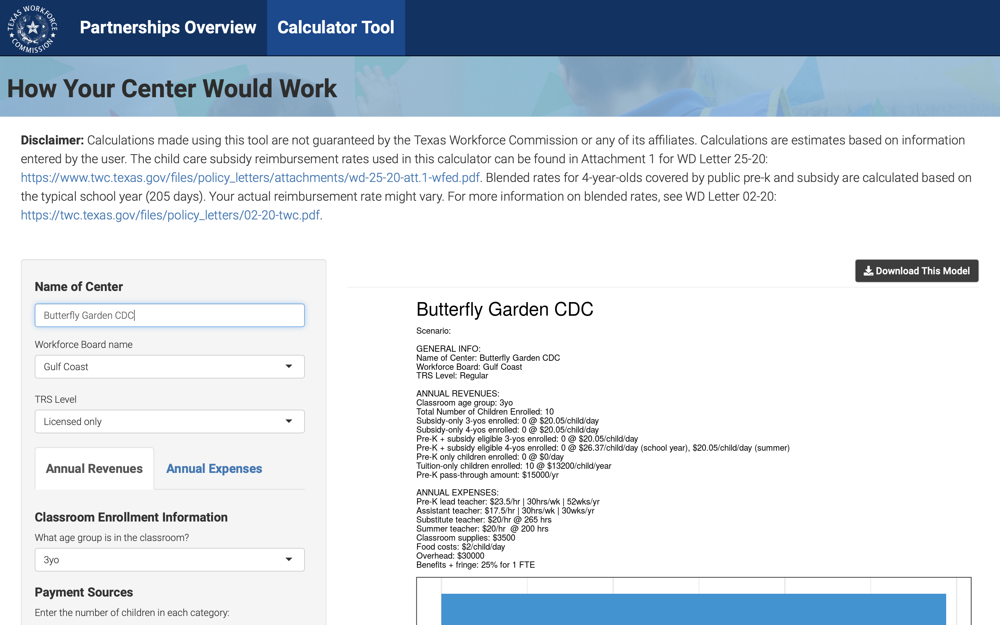
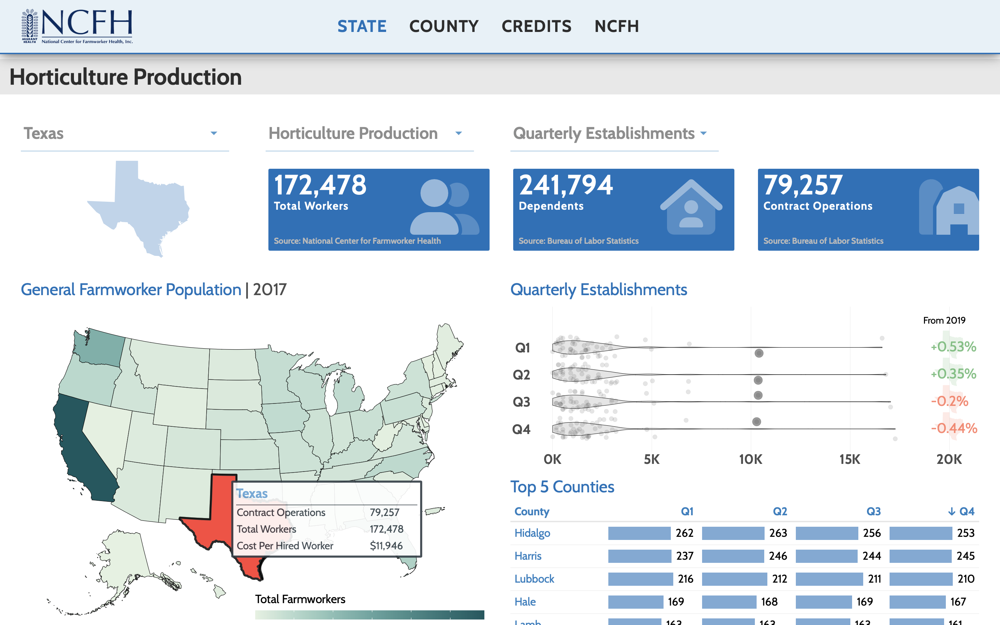
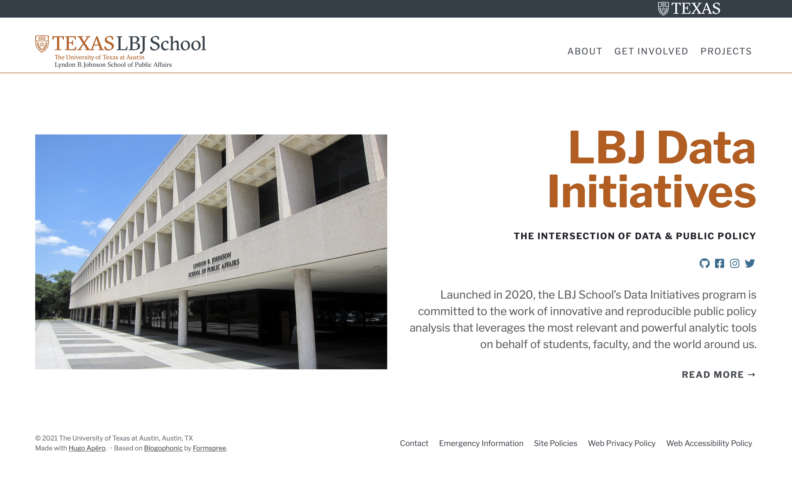
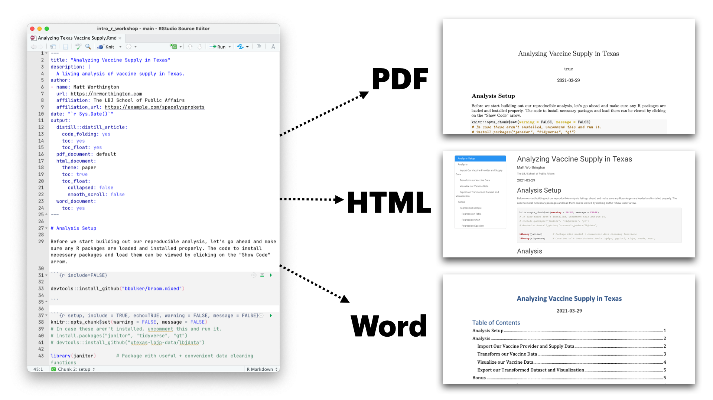
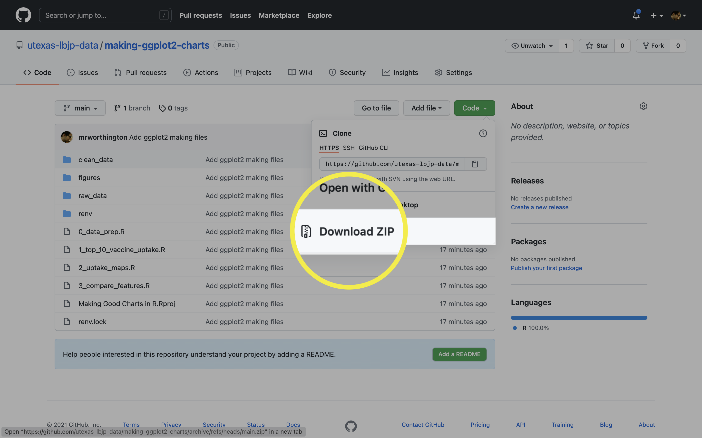
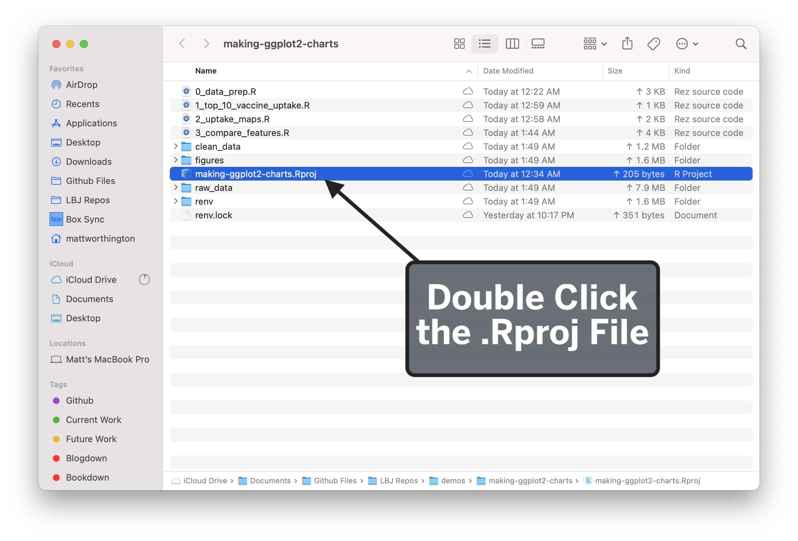

background-image: url('assets/images/dir_stat.png')
background-size: cover
class: center, bottom, inverse
```{r setup, include=FALSE}
options(htmltools.dir.version = FALSE)
knitr::opts_chunk$set(message = FALSE, warning = FALSE, comment = "", cache = FALSE, fig.retina = 3)
library(flipbookr)        # Makes Step-by-Step Code Demos
library(xaringanExtra)    # Package with Useful Stuff For Making Slides
library(tidyverse)        # What loads the core set of Modern R Packages, like ggplot2
library(tidycensus)       # Tidyverse-friendly connection to Census API
library(janitor)          # Really useful functions for cleaning data
library(lubridate)        # Makes Working With Dates Pretty Easy
library(grid)             # Organizes Visual Objects
library(ggtext)           # Helps with text in ggplot2 objects
library(cowplot)          # Helps with arranging and layering of ggplot2 objects 
library(hrbrthemes)       # A package I really like with lots of useful functions
library(gt)               # A package for making really nice tables in R
library(flair)
library(htmlwidgets)
readRenviron("~/.Renviron")
census_api_key <- Sys.getenv("CENSUS_API_KEY")
```

```{r metathis, echo=FALSE}
library(metathis)
meta() %>%
  meta_name("github-repo" = "utexas-lbjp-data/Analyzing-Texas-Vaccine-Uptake") %>% 
  meta_social(
    title = "Introduction to R + the tidyverse",
    description = paste(
      "Becoming familiar with R, R Markdown, and the tidyverse for Policy Work.",
      "Presented ain Dr. Abner's LBJ School Class in Fall 2021."
    ),
    url = "https://slides.lbjdata.org/course_workshops/abner/intro_r_workshop/intro_slides",
    image = "https://slides.lbjdata.org/course_workshops/abner/intro_r_workshop/assets/images/hp_vs_r.png",
    image_alt = paste(
      "Title slide of An Introduction R + the tidyverse"
      ),
    og_type = "website",
    og_author = "Matt Worthington",
    twitter_card_type = "summary_large_image",
    twitter_creator = "@mrworthington",
    twitter_site = "@mrworthington"
  )
```

```{r message=FALSE, warning=FALSE, include=FALSE}

theme_lbj <- function(base_size=14,base_family="SF Pro Text",title_size=18, subtitle_size=14, caption_size=10, ...) {
  ggplot2::theme_minimal(base_size = base_size,base_family = base_family,...) +
    ggplot2::theme(plot.title = ggplot2::element_text(size = title_size, color= "#005f86", family = "SFProDisplay-Heavy", margin = margin(t=0, r=0, b=4, l=0)),
                   plot.subtitle = ggplot2::element_text(color = "#bf5700", size = subtitle_size, family = "SFProDisplay-Regular", margin = margin(t=0, r=0, b=4, l=0)),
                   plot.caption = ggplot2::element_text(family="SFProDisplay-Regular", color="#333f48",size=caption_size, lineheight = 1, hjust = 0, vjust=-5,
                                                        margin = margin(t=4, r=0, b=4, l=0)),
                   plot.margin = ggplot2::unit(c(t=0, r=1.5, b=2, l=1), "lines"),
                   axis.title.x = ggplot2::element_text(family="SFProText-Bold", size=8, color="#5d5d5d", hjust=1),
                   axis.title.y = ggplot2::element_text(family="SFProText-Bold", size=8, color="#5d5d5d", hjust=1),
                   strip.text = element_text(family="SFProText-Bold", color="#ffffff"),
                   strip.background = element_rect(color="#333f48", fill="#333f48"),
                   legend.title = element_text(family="SFProText-Bold", color="#8d8d8d"),
                   axis.line.x =  ggplot2::element_line(color="#3d3d3d", size=.5),
                   panel.grid.major.y = ggplot2::element_line(color="#e3e3e3"),
                   panel.grid.minor.y = ggplot2::element_line(linetype=2, size=0, color="#e3e3e3"),
                   panel.grid.major.x = ggplot2::element_blank(),
                   panel.grid.minor.x = ggplot2::element_blank(),
                   axis.ticks.x = ggplot2::element_line(size = .5))
}
```

```{r xaringanExtra, echo=FALSE}
xaringanExtra::use_xaringan_extra(c("tile_view", "animate_css", "tachyons"))

xaringanExtra::use_share_again()
xaringanExtra::use_webcam()
xaringanExtra::style_share_again(
  share_buttons = c("twitter", "linkedin", "pocket")
)

xaringanExtra::use_extra_styles(
  hover_code_line = TRUE,         #<<
  mute_unhighlighted_code = TRUE  #<<
)

# xaringanExtra::use_broadcast()

xaringanExtra::use_fit_screen()

htmltools::tagList(
  xaringanExtra::use_clipboard(
    button_text = "<i class=\"fa fa-clipboard\"></i>",
    success_text = "<i class=\"fa fa-check\" style=\"color: #90BE6D\"></i>",
    error_text = "<i class=\"fa fa-times-circle\" style=\"color: #F94144\"></i>"
  ),
  rmarkdown::html_dependency_font_awesome()
)
```

---
class: middle

.pull-left[
# About Me
]

.pull-right[

* .orange[**Personal Background**]: Born and raised in San Antonio, Texas. Live in Austin with my wife and three kids. 
* .orange[**Education Backgrounds**]: English Studies, Special Education, and Public Policy
* .orange[**Professional Backgrounds**]: Public School Teacher, School District Administrator, and Data Scientist. 
]

---
background-image: url('https://utexas-lbjp-data.github.io/assets/rmarkdown/slide_02.jpeg')
background-size: cover
class: center, bottom, inverse

---
background-image: url('https://utexas-lbjp-data.github.io/assets/rmarkdown/slide_03.jpeg')
background-size: cover
class: center, bottom, inverse

---
class: center

# Tell Us About You

https://www.menti.com/w983jx692v

---

<div style='position: relative; padding-bottom: 56.25%; padding-top: 35px; height: 0; overflow: hidden;'><iframe sandbox='allow-scripts allow-same-origin allow-presentation' allowfullscreen='true' allowtransparency='true' frameborder='0' height='315' src='https://www.mentimeter.com/embed/7e9fc51ebd6e406fe26da3de9c0de32f/8dc0f12a3440' style='position: absolute; top: 0; left: 0; width: 100%; height: 100%;' width='420'></iframe></div>


---
background-image: url('assets/images/hermione_spell_class.png')
background-size: cover
class: center, bottom, inverse

## .blue[How to understand R if you are new...]

---
background-image: url('assets/images/hp_vs_r.png')
background-size: cover
class: center, bottom, inverse

---

# How I Hope We End Today

.pull-left[

#### Anywhere from here..

.rmd-img[]

]

.pull-right[

#### to here.


.rmd-img[]

]

---
class: showcase-bg, section, center, middle

# 🪄 Showcase

---

# Census Spellbook: `tidycensus` 

.pull-left[
```{r message=FALSE, warning=FALSE, eval=FALSE}
library(tidycensus)

# Create A List of Variables
demvars <- c(White = "P005003",    
              Black = "P005004",    
              Asian = "P005006",
              Hispanic = "P004003")

# Pull The Census Data 
harris <- get_decennial(
             geography = "tract",             
             variables = demvars,
             state = "TX", 
             county = "Harris County", 
             geometry = TRUE,
             summary_var = "P001001"
             ) |>
  # Create pct column 
  mutate(pct = 100 * (value / summary_value)) 

# Draw A Chart 
harris  |>
  ggplot(aes(fill = pct)) +
  facet_wrap(~variable) +
  geom_sf(color = NA) +
  coord_sf(crs = 26915, datum=NA) +
  scale_fill_viridis_c() +
  theme_lbj() +
  labs(title="Population Demographics in Harris County",
       subtitle="US Census | 2010 Decennial Census")
```

```{r message=FALSE, warning=FALSE, include=FALSE}
library(tidycensus)

# Create A List of Variables
demvars <- c(White = "P005003",    
              Black = "P005004",    
              Asian = "P005006",
              Hispanic = "P004003")


harris <- get_decennial(geography = "tract", variables = demvars,
                  state = "TX", county = "Harris County", geometry = TRUE,
                  summary_var = "P001001")
```
]

.pull-right[


```{r echo=FALSE, message=FALSE, warning=FALSE}

harris |>
  mutate(pct = 100 * (value / summary_value)) |>
  ggplot(aes(fill = pct)) +
  facet_wrap(~variable) +
  geom_sf(color = NA) +
  coord_sf(crs = 26915, datum=NA) +
  scale_fill_viridis_c() +
  theme_lbj() +
  labs(title="Population Demographics in Harris County",
       subtitle="US Census | 2010 Decennial Census")

```

]

---

# Table Spellbook: `gt`

.pull-left[
```{r eval = FALSE}
library(gt)

# Create A List of Variables
demvars <- c(White = "P005003", Black = "P005004",
             Asian = "P005006", Hispanic = "P004003",
             AIAN = "P005005", NHOPI = "P005007",
             Other = "P003007",`Two or More` = "P003008")

# Pull The Census Data 
harris <- get_decennial(geography = "county", variables = demvars,
                        state = "TX", county = "Harris County", summary_var = "P001001") |> 
  # Create pct column 
  mutate(pct = (value / summary_value)) |>
  select(variable, value,  pct)

# Draw A Table 
harris |>
  gt() |> # Pass The Data To A gt table
  tab_header(title = md("**Demographics in Harris County**"),
             subtitle = "Harris County reported 4,092,459 residents in the 2010 Census. Here's how each demographic group compares to the total population.") |>
  tab_source_note(source_note = "Data: US Census | 2010 Decennial Census | pulled with {tidycensus} in R") |>
  fmt_number(columns = c("value")) |>
  fmt_percent(columns = c("pct")) |>
  cols_label(
    variable = md("**Group**"),
    value = md("**Population**"),
    pct = md("**Pct. of Total**")
  )
```
]

.pull-right[
```{r table_steps, echo=FALSE, message=FALSE, warning=FALSE}

demvars <- c(White = "P005003",
              Black = "P005004",
              Asian = "P005006",
              Hispanic = "P004003",
              AIAN = "P005005",
              NHOPI = "P005007",
              Other = "P003007",
              `Two or More` = "P003008")

harris <- get_decennial(geography = "county", variables = demvars,
                  state = "TX", county = "Harris County", summary_var = "P001001") |> 
    mutate(pct = (value / summary_value)) |> 
  select(variable, value,  pct)

harris |> 
  gt() |> # Pass The Data To A gt table 
  tab_header(title = md("**Demographics in Harris County**"),
             subtitle = "Harris County reported 4,092,459 residents in the 2010 Census. Here's how each demographic group compares to the total population.") |>
  tab_source_note(
    source_note = "Data: US Census | 2010 Decennial Census (pulled with {tidycensus} in R)"
  ) |> 
  fmt_number(columns=c("value")) |> 
  fmt_percent(columns=c("pct")) |> 
  cols_label(variable=md("**Group**"),
             value=md("**Population**"),
             pct=md("**Pct. of Total**"))
```
]

---

# Static Charts: [`ggplot`]()

.pull-left[

]

.pull-right[

]

---

# Interactive Charts: [`highcharter`](https://jkunst.com/highcharter/index.html)

```{r include=FALSE}
library(highcharter)

hc_matt <- hc_theme_merge(
  hc_theme_smpl(),
  hc_theme(chart = list(backgroundColor = "#fff", 
                        style = list(fontFamily = '-apple-system, sans-serif !important', 
                                     fontSize = "28px", 
                                     color="#4d4d4d")),
           title = list(style = list(fontFamily = '-apple-system, sans-serif !important', 
                                     fontWeight = "900",
                                     color="#2d2d2d"),
                        align = "left"), 
           subtitle = list(style = list(fontFamily = '-apple-system, sans-serif !important',
                                        color="#7d7d7d",
                                        textTransform="initial",
                                        fontWeight="400",
                                        fontSize = "14px"),
                           align = "left"), 
           legend = list(align = "right", 
                         style = list(fontFamily = '-apple-system, sans-serif !important', color="#6d6d6d"),
                         itemStyle = list(fontFamily = '-apple-system, sans-serif !important', color = '#6d6d6d'),
                         itemHoverStyle = list(color = 'gray'),   
                         verticalAlign = "top"),
           credits = list(style = list(color = "#fff")),
           xAxis = list(labels =list(style = list(fontFamily = '-apple-system, sans-serif !important', color="#2d2d2d")), 
                        title = list(style = list(color = "#4d4d4d", fontSize = "12px", 
                                                  color="#4d4d4d",fontWeight="500")),
                        gridLineWidth = 0,
                        gridLineColor = "#9d9d9d", 
                        lineColor = 'rgba(0,0,0,0.7)', 
                        minorGridLineColor = 'rgba(0,0,0,0.7)', 
                        tickColor = "#9d9d9d", 
                        tickWidth = 1), 
           yAxis = list(labels =list(style = list(fontFamily = '-apple-system, sans-serif !important', color="#2d2d2d")), 
                        title = list(style = list(color = "#fff", fontSize = "12px", 
                                                  color="#fff",fontWeight="500")), 
                        gridLineWidth = .5,
                        gridLineColor = 'rgba(0,0,0,0.15)', 
                        lineColor = 'rgba(0,0,0,0.15)', 
                        minorGridLineColor = 'rgba(0,0,0,0.15)', 
                        tickColor = "#9d9d9d", 
                        tickWidth = 2)))

   myMenuItems <- c("downloadCSV", "downloadCSV", "separator", "downloadPNG", "downloadJPEG", "downloadPDF")
```

```{r highcharter, echo=FALSE, message=FALSE, warning=FALSE}
library(highcharter)

# key_events <- read_csv("https://docs.google.com/spreadsheets/d/e/2PACX-1vQ2q_c5RpywszCamM3VINgAwZ51OJoPfBFflEvXpuAqAZrw9SDovcGnfDOlF7uwzCnZf5XMkEluhlUb/pub?output=csv") |> 
#   clean_names() |> 
#   mutate(date=as_date(date))

r_naught <- read_csv("https://d14wlfuexuxgcm.cloudfront.net/covid/rt.csv") |> 
  filter(region=="TX")

# key_events_fltr <- key_events |>
#       filter(!str_detect(event,"Stimulus"))
#     
#     dates <- key_events_fltr$date
#     events <- key_events_fltr$event
#     
#     plotLines <- map2(key_events_fltr$date,key_events_fltr$event,
#                       ~list(label = list(text = .y,
#                                          style = list(color = "rgba(255, 255, 255, 0.6)", 
#                                                       fontSize='12px',textTransform='initial')),
#                             color = "rgba(255, 255, 255, 0.6)",
#                             width = 1,
#                             dashStyle = "Dash",
#                             value = datetime_to_timestamp(as.Date(.x, tz="UTC"))))


r_naught |> 
      hchart("line", hcaes(x = date, y = mean), animation=FALSE,
             tooltip = FALSE,
             threshold = 1, negativeColor = "#92ACCF",  color = "#D94B3D") |>
      hc_add_series(r_naught, type = "arearange",
                    hcaes(x = date, low = lower_80,
                          high = upper_80),
                    threshold = 1, negativeColor = "#92ACCF", color = "#D94B3D",
                    linkedTo = "r_naught") |>
      hc_plotOptions(arearange = list(fillOpacity=.3)) |>
      hc_title(
        text ="Texas Effective Reproduction Rate · R<sub>t</sub>",
        useHTML = TRUE) |> 
      hc_subtitle(
        text ="<span>From R<sub>t</sub> Live: R<sub>t</sub>  is the average number of people who become infected by an infectious person.</span><br/><span style='color: #D94B3D'>  If it’s above 1.0, COVID-19 will spread quickly.</span> <span style='color: #92ACCF'> If it’s below 1.0, infections will slow.</span>",
        useHTML = TRUE) |>
      hc_yAxis(title = list(text="Effective Reproduction Rate (R<sub>t</sub>)"),
               min = min(r_naught$lower_80), 
               max = max(r_naught$upper_80)) |> 
      hc_xAxis(title=NULL) |> 
      hc_tooltip(table = FALSE, sort = FALSE,
                 pointFormat = "Effective Reproduction Rate · R<sub>t</sub>: {point.mean:,.2f}<br>") |> 
      hc_credits(
        enabled = TRUE,
        text = "Source: rt.live Analysis",
        href = "https://rt.live") |>
      hc_add_theme(hc_matt) |> 
      hc_exporting(enabled=TRUE, scale=2, sourceWidth= 1200, sourceHeight = 600, 
                   allowHTML = TRUE,
                   buttons = list(contextButton = list(menuItems = myMenuItems, 
                                                       symbol = 'menuball', 
                                                       symbolStrokeWidth = 1,
                                                       symbolFill = 'rgba(255,209, 0, 0.9)',
                                                       symbolStroke ='#3A4A9F',
                                                       theme = list(fill='#fff'))),
                   chartOptions = list(title =  list(style = list(fontWeight = '800', fontSize = '22px', textTransform = "uppercase")),
                                       subtitle =  list(style = list(fontSize = '14px'))))
```

---

# Dashboards: `shiny`

.pull-left[

#### Texas Workforce Commission



]

.pull-right[

#### National Center for Farmworker Health



]

---

# Websites: `blogdown` + `distill`

.pull-left[

.center[#### [Blogdown](https://pkgs.rstudio.com/blogdown/)]



]

.pull-right[

.center[#### [Distill](https://pkgs.rstudio.com/distill/)]


]

---

# Books: `bookdown`

.rmd-img[]

---

# Documents: `rmarkdown`

.rmd-img[]

---

# Like anything, this is a journey...

.rmd-img[]

---
class: journey-bg, section, center, middle, inverse

# Let's get started 👟

---

# Downloading Materials

.pull-left[

### Today's Agenda

.b--gray.ba.bw2.ma2.shadow-1[

*	Navigating Rstudio
  *	Rstudio Interface
  *	R Projects
* Basics of ggplot2
  * `ggplot()`
  * `aes()`
  * `geom_*()`
  * `scale_*()`
  * `theme_*()`
  * `labs()`
* Exporting Data & Charts
  * `ggsave()`

]
]


.pull-right[

### Today's Materials

.b--gray.ba.bw2.ma2.pa2.shadow-1[

#### What You Should Download

* [**ggplot2 Materials** ](https://tinyurl.com/making-ggplot2-charts): tinyurl.com/making-ggplot2-charts

#### What You Should Reference Later

* [**Today's Slides**](https://slides.lbjdata.org/data-studio/ggplot2_basics/index.html)
* [**The ggplot2 Website**](https://ggplot2.tidyverse.org)
* [**Chapter 1 of R For Data Science**](https://r4ds.had.co.nz/data-visualisation.html)
]
]

---
background-image: url('assets/images/rstudio_hex.png')
background-size: cover
class: center, bottom

---

# Downloading The Materials 

* [**Rmarkdown Analysis** ](tinyurl.com/TXVaxUptake): tinyurl.com/TXVaxUptake




---

# Open the `.Rproj` file

.rmd-img[]

---
background-image: url('https://utexas-lbjp-data.github.io/assets/rmarkdown/slide_17.jpeg')
background-size: cover
class: center, bottom, inverse

---
background-image: url('https://utexas-lbjp-data.github.io/assets/rmarkdown/slide_18.jpeg')
background-size: cover
class: center, bottom, inverse

---
background-image: url('assets/images/tidyverse_hex.png')
background-size: cover
class: center, bottom, inverse

---
background-image: url('assets/images/tidyverse_network.png')
background-size: cover
class: center, bottom, inverse animated fadeIn

---
background-image: url('assets/images/tidyverse_data_lifecycle_map.png')
background-size: cover
class: center, bottom, inverse animated fadeIn

---
background-image: url('assets/images/lifecycle_focus.png')
background-size: cover
class: center, bottom, inverse animated fadeIn

---
background-image: url('assets/images/what_todays_focus_will_be.png')
background-size: cover
class: center, bottom, inverse animated animate fadeIn

---
background-image: url('assets/images/marie_kondo.png')
background-size: cover
class: center, bottom, inverse animated fadeIn

---

# What is ggplot2?

.pull-left.b--gray.ba.bw2.ma2.pa4.shadow-1[
* ["An authoring framework for data science."](https://rmarkdown.rstudio.com/lesson-1.html) (✔️)
* [A document format (.Rmd)](https://bookdown.org/yihui/rmarkdown/). (✔️)
* [An R package named rmarkdown](https://rmarkdown.rstudio.com/docs/). (✔️)
* ["A file format for making dynamic documents with R."](https://rmarkdown.rstudio.com/articles_intro.html) (✔️)
* ["A tool for integrating text, code, and results."](https://r4ds.had.co.nz/communicate-intro.html) (✔️)
* ["A computational document."](http://radar.oreilly.com/2011/07/wolframs-computational-documen.html) (✔️)
* Wizardry. (🧙️)
]

.pull-right[
.rmd-small[]
]

.tl.burntorange[
Courtesy of Alison Presmanes Hill ([@apreshill](https://twitter.com/apreshill))
]

---
class: center middle

.rmd-img[]

---
class: center middle

.rmd-tiniest[]

.tl.burntorange[
Credit: Georgios Karamanis ([@geokaramanis](https://twitter.com/geokaramanis))
]

---
class: center middle

.rmd-med[]

.tl.burntorange[
Credit: Cédric Scherer ([@CedScherer](https://twitter.com/CedScherer))
]

---
class: center middle

.rmd-small[]

.tl.burntorange[
Credit: Cédric Scherer ([@CedScherer](https://twitter.com/CedScherer))
]

---

background-image: url('https://utexas-lbjp-data.github.io/assets/rmarkdown/slide_17.jpeg')
background-size: cover
class: center, bottom, inverse

---
background-image: url('https://utexas-lbjp-data.github.io/assets/rmarkdown/slide_18.jpeg')
background-size: cover
class: center, bottom, inverse

---

background-image: url('https://utexas-lbjp-data.github.io/assets/rmarkdown/slide_19.jpeg')
background-size: cover
class: center, bottom, inverse

---
class: title center pipe-page

# `|>` and `%>%` and `+`

```{r echo=FALSE, tidy=FALSE}
decorate('
leave_house(get_dressed(get_out_of_bed(wake_up(me, time = "8:00"), side = "correct"), pants = TRUE, shirt = TRUE), car = TRUE, bike = FALSE)
', eval = FALSE) |> 
  flair_args(color = "#005f86") |>
  flair_funs(color = "#333f48", background = "#FFC0DC", before = "<b>", after = "</b>") |>
  flair_input_vals(color = "#bf5700") |>
  knit_print.with_flair()
```

--
  
```{r echo=FALSE, tidy=FALSE}
decorate('
me |> 
  wake_up(time = "8:00") |> 
  get_out_of_bed(side = "correct") |> 
  get_dressed(pants = TRUE, shirt = TRUE) |> 
  leave_house(car = TRUE, bike = FALSE)
', eval = FALSE) |> 
  flair("|>") |>
  flair_args(color = "#005f86") |>
  flair_funs(color = "#333f48", background = "#FFC0DC", before = "<b>", after = "</b>") |>
  flair_input_vals(color = "#bf5700") |>
  knit_print.with_flair()
```

.tl.footnote-small[
Courtesy of Andrew Heiss ([@andrewheiss](https://twitter.com/andrewheiss))
]

---
class: vaccine-bg, section, center, middle, inverse

# And now... making charts in ggplot2

---

# The Basics of a ggplot2 chart

.pull-left[

```{r eval=FALSE}

library(ggplot2)
library(ggthemes)

diamonds |>  # Call On Your Dataset
  ggplot() +  # Draw A Canvas
  aes(cut, fill = cut) +  # Define How The Data Gets Mapped
  geom_bar(show.legend = FALSE) +  # Define What Kind of Chart to Draw
  labs(
    x = "Cut",  # Specify X-Axis Label                       
    y = "Count",  # Specify Y-Axis Label
    title = "A Fancy diamonds Plot", # Specify Title Label
    subtitle = "A compelling subtitle", # Specify Subtitle Label
    caption = "Source: ggplot2 package | Data: 'diamonds'"  # Specify Source/Caption Label
  ) +
  theme_minimal() + # Add the minimal Theme
  theme(plot.title = element_text(color = "#bf5700")) +   # Modify Title's Color
  ggthemes::scale_fill_tableau(palette = "Color Blind")   # Add A Color Blind Friendly Palette

```

]

.pull-right[

```{r fancy_diamonds, echo=FALSE, message=FALSE, warning=FALSE, fig.retina=3}

library(ggplot2)
library(ggthemes)

diamonds %>%  # Call On Your Dataset
  ggplot() +  # Draw A Canvas
  aes(cut, fill = cut) +  # Define How The Data Gets Mapped
  geom_bar(show.legend = FALSE) +  # Define What Kind of Chart to Draw
  labs(
    x = "Cut",  # Specify X-Axis Label                       
    y = "Count",  # Specify Y-Axis Label
    title = "A Fancy diamonds Plot", # Specify Title Label
    subtitle = "A compelling subtitle", # Specify Subtitle Label
    caption = "Source: ggplot2 package | Data: 'diamonds'"  # Specify Source/Caption Label
  ) +
  theme_minimal() + # Add the minimal Theme
  theme(plot.title = element_text(color = "#bf5700")) +   # Modify Title's Color
  scale_fill_tableau(palette = "Color Blind")   # Add A Color Blind Friendly Palette  

```
]

---

## `ggplot()`

**What it does:** Draws a canvas for your chart

.rmd-small[]

.tl.burntorange[
Credit: ([@allison_horst](https://twitter.com/allison_horst))
]

---

## `aes()`

**What it does:** Lets you dictate what goes where on the chart, like what's on the x-axis versus the y-axis or how stuff gets colored.

.rmd-small[]

.tl.burntorange[
Credit: ([@allison_horst](https://twitter.com/allison_horst))
]

---

## `geom_*()`

**What it does:** Lets you add shapes to your charts (bars vs. points vs. lines vs. maps, etc.)

.rmd-small[]

.tl.burntorange[
Credit: ([@allison_horst](https://twitter.com/allison_horst))
]

---

## `theme_*()`

**What it does:** Lets you add style to the chart!

.rmd-small[]

.tl.burntorange[
Credit: ([@allison_horst](https://twitter.com/allison_horst))
]

---

## `scale_*()`

**What it does:** Lets you change or adjust things about scales you've mapped using `aes()`.

.rmd-small[]

.tl.burntorange[
Credit: ([@allison_horst](https://twitter.com/allison_horst))
]

---

## `labs()`

**What it does:** Lets you add or adjust labels on your chart.

.rmd-small[]

---

`r chunk_reveal(title = "# A step by step view", chunk_name = "fancy_diamonds", break_type = "auto")`

---

# Visualizing Our Data

.pull-left[

```{r draw-viz, include = FALSE}

```


]

.pull-right[

```{r draw-viz-real, echo = FALSE, include = FALSE}

```

]

---


---

# Exporting Our Data

### Step 1: Export Our Chart

```{r eval=FALSE, include=FALSE}
ggsave("vaccine_uptake_chart.png", uptake_sorted, dpi = 300, width = 10, height = 6, bg = "white")
```

### Step 2: Export Our Data

```{r eval=FALSE, include=FALSE}
write_csv(ranked_uptake, "vaccine_uptake_top_10.csv")
```

---
class: journey-bg, section, left, middle, inverse

# 📚 Resources 📚

## Questions? lbjdata.org

#### [#rstats hashtag](https://twitter.com/search?q=%23rstats) on twitter
#### R For Data Science - [Online Book](https://r4ds.had.co.nz) | [Hard Copy](https://www.oreilly.com/library/view/r-for-data/9781491910382/) | [Slack Community](https://www.rfordatasci.com)

---
class: journey-bg, section, center, middle, inverse

# 🙏 Thank you 🙏

## Questions? lbjdata.org

### 📧: matthew.worthington@austin.utexas.edu
### 🐦: @mrworthington
