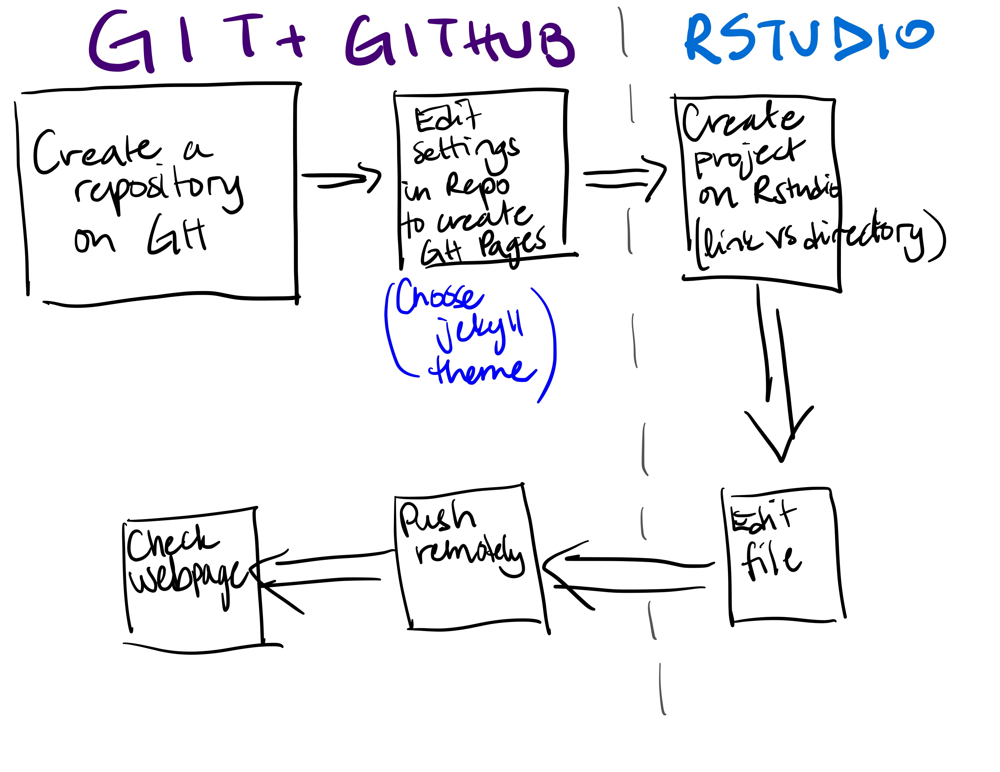

class: middle

```{r setup, include=FALSE}
options(htmltools.dir.version = FALSE)
knitr::opts_chunk$set(message = FALSE, warning = FALSE, comment = "", cache = FALSE, fig.retina = 3)
library(flipbookr)        # Makes Step-by-Step Code Demos
library(xaringanExtra)    # Package with Useful Stuff For Making Slides
library(tidyverse)        # What loads the core set of Modern R Packages, like ggplot2
library(tidycensus)       # Tidyverse-friendly connection to Census API
library(janitor)          # Really useful functions for cleaning data
library(lubridate)        # Makes Working With Dates Pretty Easy
library(grid)             # Organizes Visual Objects
library(ggtext)           # Helps with text in ggplot2 objects
library(cowplot)          # Helps with arranging and layering of ggplot2 objects 
library(hrbrthemes)       # A ppackage I really like with lots of useful functions
library(htmlwidgets)
library(lbjdata)
readRenviron("~/.Renviron")
census_api_key <- Sys.getenv("CENSUS_API_KEY")
```

```{r xaringanExtra, include=FALSE}
xaringanExtra::use_xaringan_extra(c("tile_view", "animate_css", "tachyons"))

xaringanExtra::use_share_again()
xaringanExtra::use_webcam()
xaringanExtra::style_share_again(
  share_buttons = c("twitter", "linkedin", "pocket")
)

xaringanExtra::use_extra_styles(
  hover_code_line = TRUE,         #<<
  mute_unhighlighted_code = TRUE  #<<
)

xaringanExtra::use_logo(
  image_url = "assets/lbj_white.svg"
)

xaringanExtra::use_fit_screen()

htmltools::tagList(
  xaringanExtra::use_clipboard(
    button_text = "<i class=\"fa fa-clipboard\"></i>",
    success_text = "<i class=\"fa fa-check\" style=\"color: #90BE6D\"></i>",
    error_text = "<i class=\"fa fa-times-circle\" style=\"color: #F94144\"></i>"
  ),
  rmarkdown::html_dependency_font_awesome()
)
```


## About this session

We will explore how to navigate Github and Rstudio as ecosystems and establish a basic workflow that includes an interaction between the two systems with a static webpage as a final product.


---

In this session we will be adopting the following workflow (of so so many):



Disclaimer: This workflow places strong emphasis on RStudio in terms of content creation, whereas Github is mainly used for product sharing.

---

## Prerequisites

1. GitHub account
2. GitHub desktop app
3. RStudio (cloud/desktop)
4. Local computer has the following programming languages installed:
  1. R
  2. Git


---

## What is Git?

- Git is a version control programming language.
  - Version control: think of it as Google doc history
  - Repository: think of it as a folder on your computer.

## What is GitHub?

- GitHub is an online hosting provider that is based on Git

## What is GitHub Pages?

- Webpages that are created directly from your git repository that is hosted in your GitHub account.

---

## Step 2: Creating a project

- Most of the time when we are creating a new project, we open a new file (Word, Excel, Google doc, etc.) on our computer (local machine to be fancy) and start creating right way.
- In this workshop, we want to show you a more systematic way of creating and engaging with a project that consists of many elements.
- Taking a step back, instead of opening a new file to start creating your product, you create a folder for that product.

- That's where R Projects and Github repositories come in.

- There are several ways to create an R Project:

  1. As a brand new folder (aka directory) on your computer
  2. From an existing directory on you local machine
  3. From a remote repository (a previously created Github repository)
  
- For this session we will go with step 3

---
